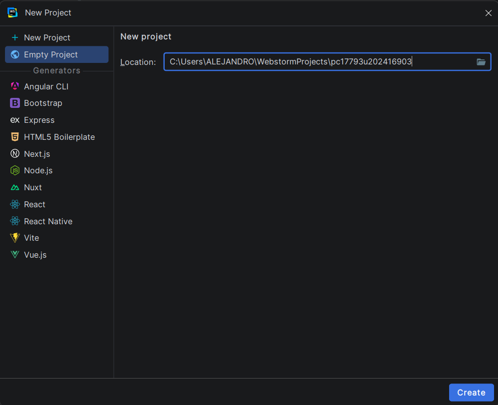
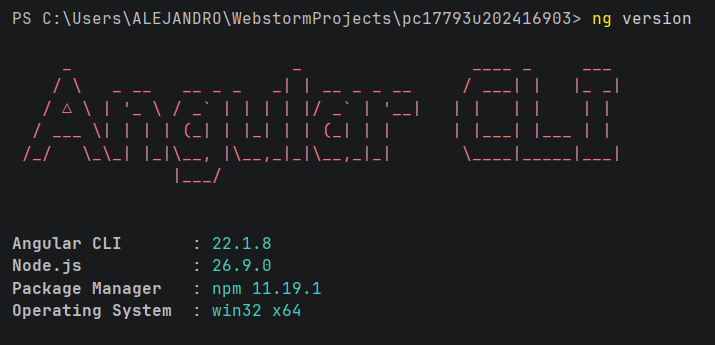
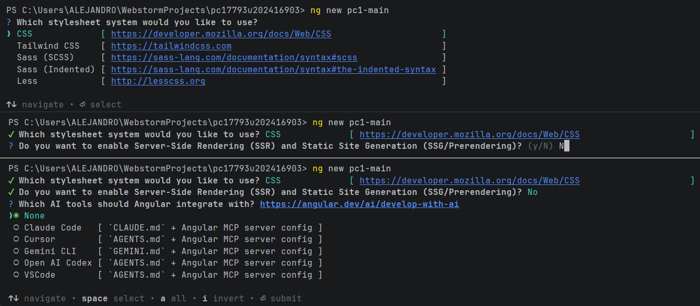
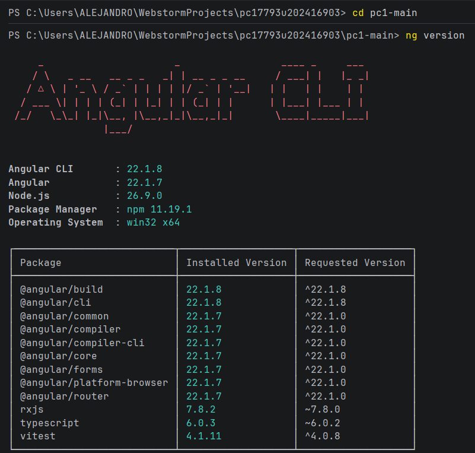
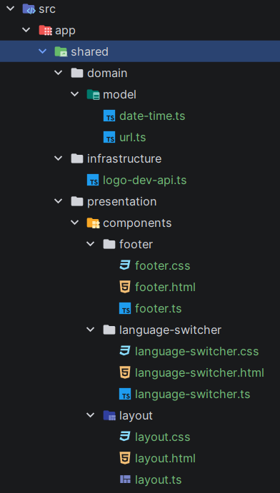
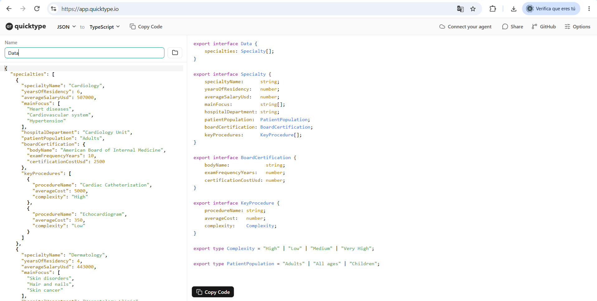
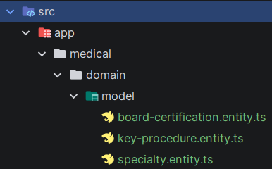
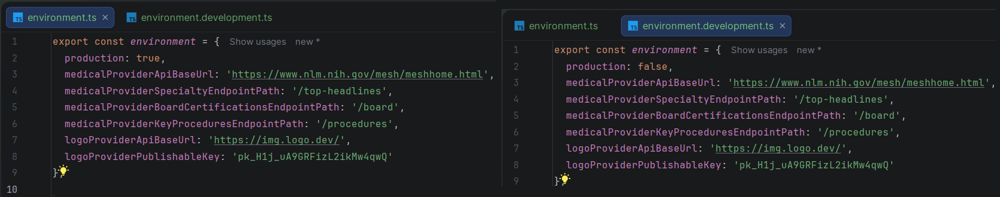

# REPASO 1 - OPEN SOURCE (Desarrollando un examén pasado)

## CREAR PROYECTO

Al empezar, selecciona estas opciones y crea el proyecto:



Luego, en terminal, por si acaso, ejecuta este comando para ver si tienes instalado las cosas necesarias:



Después, ejecuta estos comandos para empezar con el proyecto:



Finalmente ejecutas estos comandos y empiezas con el proyecto:

```bash
cd pc1-main
ng version
```


## DESARROLLAR PROYECTO

### Shared

Para empezar, hay que ejecutar:

```bash
ng g class shared/domain/model/date-time
ng g class shared/domain/model/url

ng g class shared/infrastructure/logo-dev-api

ng g c shared/presentation/components/footer
ng g c shared/presentation/components/language-switcher
ng g c shared/presentation/components/layout
```

Así debe quedar, después de ejecutar estos comandos y eliminar algunos archivos:



Luego, tienes que desarrollar estos archivos:
* Los archivos de domain/model: "date-time.ts" y "url.ts" (Estos son opcionales)
* Los archivos de "footer" y luego conectarlos con "app.html (Para ver si funciona)
```bash
<app-footer/>
```

### Medical

Antes, con la base de datos que te dieron, copias y pegas los datos dentro de "https://app.quicktype.io/" y haz esto:



Luego, ejecutas esto y eliminas el archivo que termina en ".spec.ts"":
```bash
ng g class medical/domain/model/specialty --type=entity
ng g class medical/domain/model/BoardCertification --type=entity
ng g class medical/domain/model/KeyProcedure --type=entity      
```

Así deben quedar:



### Environments

Ejecuta esto:
```bash
ng g environments
```

Así deben quedar los 2 archivos:


