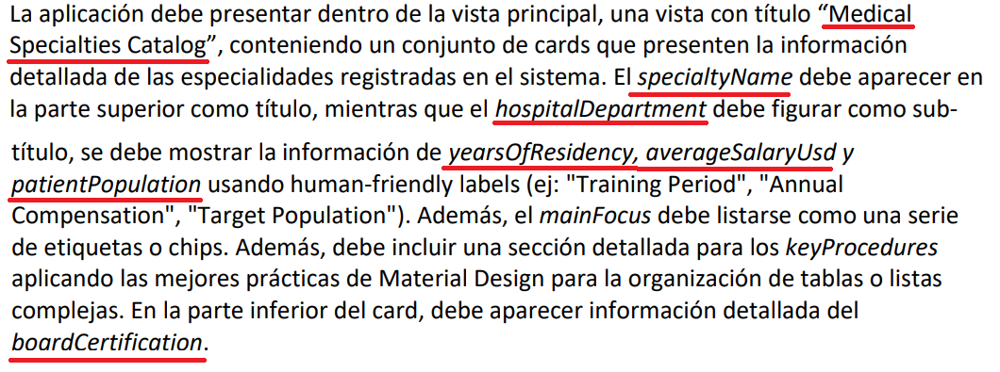
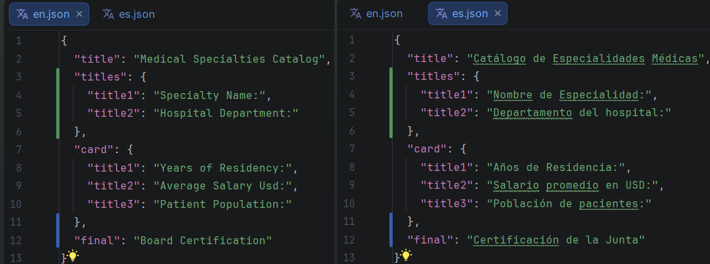
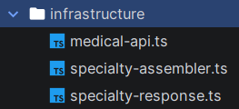
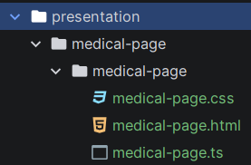
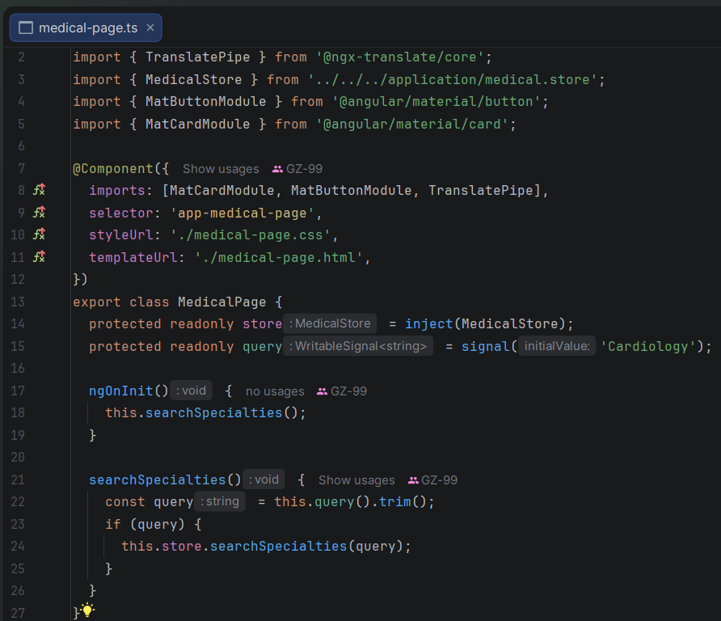
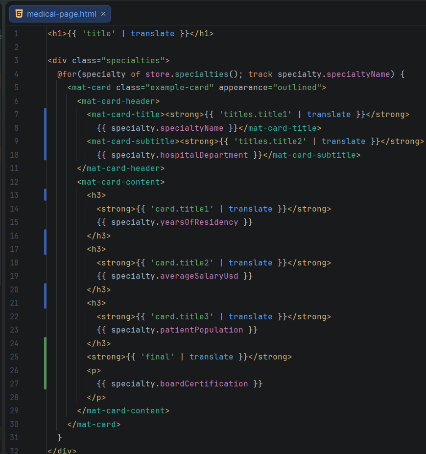
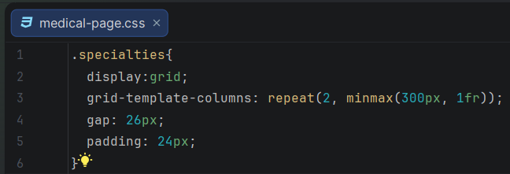
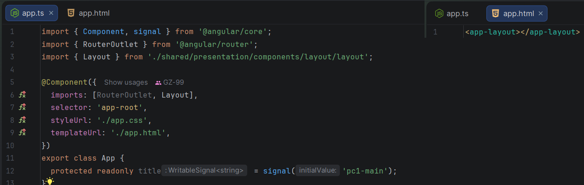
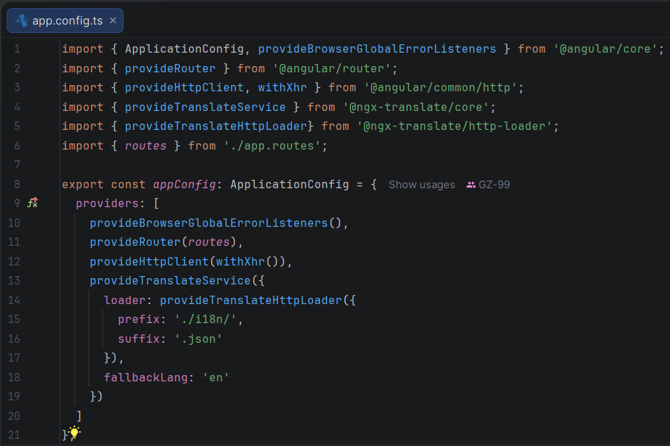
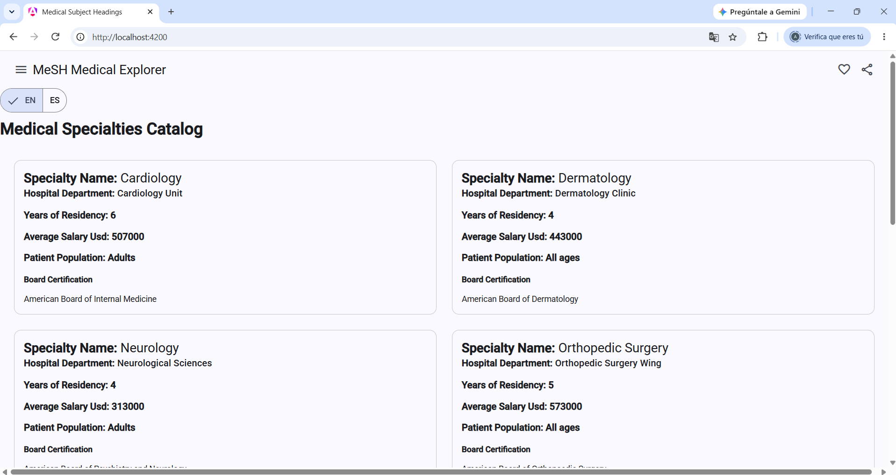

# REPASO 1 - OPEN SOURCE (Desarrollando un examén pasado)

Repositorio de apoyo 1: https://github.com/GZ-99/Catch-Up-Main-OpenSource2026
<br>
Repositorio de apoyo 2: https://github.com/GZ-99/Catch-Up-Master-OpenSource2026

## CREAR PROYECTO

Al empezar, selecciona estas opciones y crea el proyecto:


Luego, en terminal, por si acaso, ejecuta este comando para ver si tienes instalado las cosas necesarias:


Después, ejecuta estos comandos para empezar con el proyecto:


Finalmente ejecutas estos comandos y empiezas con el proyecto:

```bash
cd pc1-main
ng version
```


## DESARROLLAR PROYECTO

### Shared

Para empezar, hay que ejecutar:

```bash
ng add @angular/material
npm install @ngx-translate/core
npm install @ngx-translate/http-loader
ng g c shared/presentation/components/footer
ng g c shared/presentation/components/toolbar
ng g c shared/presentation/components/language-switcher
ng g c shared/presentation/components/layout
```

Así debe quedar, después de ejecutar estos comandos y eliminar algunos archivos:


Luego, tienes que desarrollar estos archivos:
* Los archivos de "footer" y luego conectarlos con "app.html (Para ver si funciona)
```bash
<app-footer/>
```
* Luego, desarrollas los arhivos de "toolbar".
* Después, desarrollas los archivos de "language-switcher"

### i18n

Basandote en lo que dice el problema, haces los archivos "en.json" y "es.json"





### Medical

Antes, con la base de datos que te dieron, copias y pegas los datos dentro de "https://app.quicktype.io/" y haz esto:


Luego, ejecutas esto y eliminas el archivo que termina en ".spec.ts":
```bash
ng g class medical/domain/model/specialty --type=entity
```

Así deben quedar (Incluso si hay sub clases, solhaz un entity del principal):


###  Data (Por si acaso)

En caso de que el url que te pasen no funcione o simplemente te pasen una base de datos, en la carpeta "public", debes agregarlo como "data.json"

### Environments

Ejecuta esto:
```bash
ng g environments
```

Así deben quedar los 2 archivos:


### Medical

Ejecutas estos commandos y eliminas los archivo que termina en ".spec.ts":

```bash
ng g interface medical/infrastructure/specialty-response
ng g service medical/infrastructure/specialty-assembler
ng g service medical/infrastructure/medical-api
```

Así deben quedar:



Después debes ejecutar este comando y, como siempre, eliminar el archivo que termina con ".spec.ts":

```bash
ng g service medical/application/medical --type=store
```

Finalmente, para terminar con esta carpeta, ejecuta este comando para crear la capa presentation:

```bash
ng g c medical/presentation/medical-page/medical-page
```

Así debe quedar:



Así deben quedar los archivos:

* "medical-page.ts":
<br>
* "medical-page.html": Aquí se organiza todos los datos con sus traducciones
<br>
* "medical-page.css":
<br>

### Shared

Luego debes modificar los archivos "layout", para conectarlo con lo demás

## TERMINAR PROYECTO

Finalmente, hay que modificar los archivos "app.ts" y "app.html":



Al mismo tiempo que tienes que configurar el archivo "app.config.ts" de esta forma:



Este es el resultado final:


